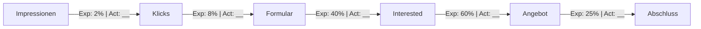
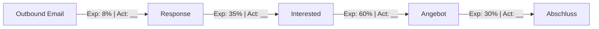

# IMR Media – Umfassende Vermarktungsstrategie

---

## ARCHITEKTUR & FLOWCHARTS

### Gesamtübersicht: Marketing-Ökosystem

```
┌──────────────────────────────────────────────────────────────────────────────────────┐
│                            IMR MEDIA MARKETING SYSTEM                                │
├──────────────────────────────────────────────────────────────────────────────────────┤
│                                                                                      │
│   ┌──────────────────────────── TRAFFIC SOURCES ────────────────────────────────┐   │
│   │                                                                              │   │
│   │  ┌──────────┐ ┌──────────┐ ┌──────────┐ ┌──────────┐ ┌──────────────────┐   │   │
│   │  │ META ADS │ │GOOGLE ADS│ │ ORGANIC  │ │  COLD    │ │   REFERRALS      │   │   │
│   │  │  (40%)   │ │  (25%)   │ │  (5%)    │ │ OUTREACH │ │    (5%)          │   │   │
│   │  │          │ │          │ │          │ │  (25%)   │ │                  │   │   │
│   │  └────┬─────┘ └────┬─────┘ └────┬─────┘ └────┬─────┘ └────────┬─────────┘   │   │
│   │       │            │            │            │                 │             │   │
│   └───────┼────────────┼────────────┼────────────┼─────────────────┼─────────────┘   │
│           │            │            │            │                 │                  │
│           └────────────┴─────┬──────┴────────────│─────────────────┘                  │
│                              ▼                   │                                    │
│                  ┌───────────────────────┐       │                                    │
│                  │    LANDING PAGE       │       │                                    │
│                  │   imr-media.de        │       │                                    │
│                  └───────────┬───────────┘       │                                    │
│                              ▼                   │                                    │
│                  ┌───────────────────────┐       │    ┌─────────────────────────┐    │
│                  │    LEAD FORMULAR      │       │    │   COLD OUTREACH FLOW    │    │
│                  │  + Qualifizierung     │       │    │                         │    │
│                  └───────────┬───────────┘       │    │ Hässliche Website found │    │
│                              │                   │    │         ▼               │    │
│                              │                   │    │ Auto-Design erstellt    │    │
│                              │                   │    │         ▼               │    │
│                              │                   └───▶│ E-Mail: Vorher/Nachher  │    │
│                              │                        │         ▼               │    │
│                              │                        │ (Cold Call Follow-up)   │    │
│                              │                        └───────────┬─────────────┘    │
│                              │                                    │                  │
│                              └──────────────┬─────────────────────┘                  │
│                                             ▼                                        │
│   ┌────────────────────────── SALES PIPELINE ─────────────────────────────────┐     │
│   │                                                                            │     │
│   │  ┌─────────┐   ┌─────────┐   ┌─────────┐   ┌─────────┐                    │     │
│   │  │INTERESSE│──▶│ PAKETE  │──▶│  CALL   │──▶│ABSCHLUSS│                    │     │
│   │  │ geweckt │   │ zeigen  │   │         │   │         │                    │     │
│   │  └─────────┘   └─────────┘   └─────────┘   └────┬────┘                    │     │
│   │                                                  │                         │     │
│   └──────────────────────────────────────────────────┼─────────────────────────┘     │
│                                                      ▼                               │
│                                          ┌───────────────────┐                       │
│                                          │      KUNDE        │                       │
│                                          │ 1.299€ / 1.799€ / │                       │
│                                          │      2.399€       │                       │
│                                          └─────────┬─────────┘                       │
│                                                    ▼                                 │
│                                          ┌───────────────────┐                       │
│                                          │    UPSELLING      │                       │
│                                          │ Hosting, SEO, etc │                       │
│                                          └───────────────────┘                       │
│                                                                                      │
└──────────────────────────────────────────────────────────────────────────────────────┘
```

---

### Customer Journey Flowchart

```
┌─────────────────────────────────────────────────────────────────────────────┐
│                          CUSTOMER JOURNEY                                   │
└─────────────────────────────────────────────────────────────────────────────┘

  AWARENESS              INTEREST               DECISION              ACTION
     │                      │                      │                     │
     ▼                      ▼                      ▼                     ▼
┌─────────┐           ┌─────────┐           ┌─────────┐           ┌─────────┐
│ Sieht   │           │ Klickt  │           │ Sieht   │           │ Bucht   │
│ Video   │──────────▶│ auf Ad  │──────────▶│ Entwurf │──────────▶│ Paket   │
│ auf IG  │           │         │           │         │           │         │
└─────────┘           └─────────┘           └─────────┘           └─────────┘
     │                      │                      │                     │
     │                      ▼                      ▼                     ▼
     │               ┌─────────┐           ┌─────────┐           ┌─────────┐
     │               │ Füllt   │           │ E-Mail  │           │ Zahlung │
     │               │ Lead-   │──────────▶│ Sequenz │           │ via     │
     │               │ Form    │           │ + Call  │           │ Stripe  │
     │               └─────────┘           └─────────┘           └─────────┘
     │                                                                  │
     │                                                                  ▼
     │                                                           ┌─────────┐
     └──────────────────── REMARKETING ◀─────────────────────────│ KUNDE   │
                          (falls kein                            │ ★★★★★   │
                           Abschluss)                            └─────────┘
                                                                       │
                                                                       ▼
                                                               ┌─────────────┐
                                                               │  REFERRAL   │
                                                               │  PROGRAMM   │
                                                               └─────────────┘
```

---

### Cold Outreach Funnel (E-Mail + Cold Call)

```
┌─────────────────────────────────────────────────────────────────────────────────────┐
│                         COLD OUTREACH SALES FUNNEL                                  │
└─────────────────────────────────────────────────────────────────────────────────────┘

  PHASE 1                PHASE 2                PHASE 3               PHASE 4
  PROSPECTING            OUTREACH               FOLLOW-UP             CLOSING
      │                      │                      │                     │
      ▼                      ▼                      ▼                     ▼
┌───────────┐          ┌───────────┐          ┌───────────┐         ┌───────────┐
│  Hässliche│          │ AUTO-     │          │  ANTWORT  │         │   CALL    │
│  Websites │─────────▶│ DESIGN    │─────────▶│  ERHALTEN │────────▶│  BUCHEN   │
│  finden   │          │ erstellen │          │     ?     │         │           │
└───────────┘          └─────┬─────┘          └─────┬─────┘         └─────┬─────┘
      │                      │                      │                     │
      ▼                      ▼                      │                     ▼
┌───────────┐          ┌───────────┐               │              ┌───────────┐
│ Quellen:  │          │ HTML-     │               │              │  PAKETE   │
│ • Google  │          │ E-MAIL    │               │              │  ZEIGEN   │
│ • Branchen│          │ senden    │               │              │           │
│ • Lokal   │          │           │               │              │ • Starter │
└───────────┘          │ Vorher/   │               │              │   1.299€  │
                       │ Nachher   │               │              │ • Growth  │
                       │ Bild      │               │              │   1.799€  │
                       └─────┬─────┘               │              │ • Premium │
                             │                     │              │   2.399€  │
                             ▼                     │              └─────┬─────┘
                       ┌───────────┐               │                    │
                       │ WARTEN    │               │                    ▼
                       │ 2-3 Tage  │               │              ┌───────────┐
                       └─────┬─────┘               │              │ ABSCHLUSS │
                             │                     │              │           │
                             ▼                     │              └───────────┘
                       ┌───────────┐               │
                       │ COLD CALL │               │
                       │ Follow-up │◀──────────────┘
                       │           │         (keine Antwort)
                       │ "Haben Sie│
                       │ die E-Mail│
                       │ gesehen?" │
                       └─────┬─────┘
                             │
              ┌──────────────┼──────────────┐
              ▼              ▼              ▼
        ┌─────────┐    ┌─────────┐    ┌─────────┐
        │   JA    │    │  NEIN   │    │ KEIN    │
        │Interesse│    │ Interesse│   │ INTERESSE│
        └────┬────┘    └────┬────┘    └─────────┘
             │              │
             ▼              ▼
       ┌──────────┐   ┌──────────┐
       │ Call     │   │ In CRM   │
       │ vereinb. │   │ für      │
       │ → Pakete │   │ später   │
       │ zeigen   │   │ markieren│
       └──────────┘   └──────────┘


┌─────────────────────────────────────────────────────────────────────────────────────┐
│                           COLD OUTREACH E-MAIL SEQUENZ                              │
├─────────────────────────────────────────────────────────────────────────────────────┤
│                                                                                     │
│  TAG 0              TAG 2-3            TAG 5              TAG 7                     │
│    │                  │                  │                  │                       │
│    ▼                  ▼                  ▼                  ▼                       │
│ ┌──────┐          ┌──────┐          ┌──────┐          ┌──────┐                     │
│ │E-MAIL│          │COLD  │          │E-MAIL│          │LETZTER│                     │
│ │  #1  │─────────▶│ CALL │─────────▶│  #2  │─────────▶│CHECK- │                     │
│ │      │          │      │          │      │          │  IN   │                     │
│ └──┬───┘          └──────┘          └──┬───┘          └───────┘                     │
│    │                                   │                                            │
│    ▼                                   ▼                                            │
│ ┌────────────────┐              ┌────────────────┐                                  │
│ │ INHALT:        │              │ INHALT:        │                                  │
│ │                │              │                │                                  │
│ │ • Betreff:     │              │ • Betreff:     │                                  │
│ │   "Ihre neue   │              │   "Kurze       │                                  │
│ │   Website?"    │              │   Rückfrage"   │                                  │
│ │                │              │                │                                  │
│ │ • Vorher/      │              │ • Referenz auf │                                  │
│ │   Nachher Bild │              │   E-Mail #1    │                                  │
│ │                │              │                │                                  │
│ │ • "Wir haben   │              │ • "Haben Sie   │                                  │
│ │   uns Ihre     │              │   den Entwurf  │                                  │
│ │   Website      │              │   gesehen?"    │                                  │
│ │   angeschaut"  │              │                │                                  │
│ │                │              │ • CTA: Kurzer  │                                  │
│ │ • CTA: Antwort │              │   Call         │                                  │
│ │   oder Call    │              │                │                                  │
│ └────────────────┘              └────────────────┘                                  │
│                                                                                     │
└─────────────────────────────────────────────────────────────────────────────────────┘


┌─────────────────────────────────────────────────────────────────────────────────────┐
│                    NACH INTERESSE: SALES-PROZESS                                    │
├─────────────────────────────────────────────────────────────────────────────────────┤
│                                                                                     │
│  OPTION A: Schneller Abschluss (empfohlen bei klarem Interesse)                    │
│  ──────────────────────────────────────────────────────────────────                 │
│                                                                                     │
│  ┌─────────┐    ┌─────────────┐    ┌─────────────┐    ┌──────────┐                 │
│  │Interesse│───▶│ Pakete per  │───▶│ Kurzer Call │───▶│ Angebot  │                 │
│  │via Mail │    │ E-Mail mit  │    │ (15 Min)    │    │ senden + │                 │
│  │         │    │ Preisen     │    │ Fragen      │    │ Abschluss│                 │
│  └─────────┘    │ senden      │    │ klären      │    └──────────┘                 │
│                 └─────────────┘    └─────────────┘                                  │
│                                                                                     │
│  Antwort-Template:                                                                  │
│  "Freut mich, dass Ihnen der Entwurf gefällt! Hier unsere Pakete:                  │
│   • Starter (1.299€): 3 Seiten, 2 Korrekturschleifen                               │
│   • Growth (1.799€): 6 Seiten, 3 Korrekturschleifen ← Empfehlung                   │
│   • Premium (2.399€): 10 Seiten, 5 Korrekturschleifen                              │
│   Haben Sie 15 Minuten für einen kurzen Call? [Calendly-Link]"                     │
│                                                                                     │
│  ─────────────────────────────────────────────────────────────────────────────     │
│                                                                                     │
│  OPTION B: Ausführlicher Prozess (bei Rückfragen/Unsicherheit)                     │
│  ──────────────────────────────────────────────────────────────────                 │
│                                                                                     │
│  ┌─────────┐    ┌─────────────┐    ┌─────────────┐    ┌──────────┐                 │
│  │Interesse│───▶│ Call buchen │───▶│ Im Call:    │───▶│ Angebot  │                 │
│  │via Mail │    │ (Calendly)  │    │ Bedarf      │    │ nach     │                 │
│  │         │    │             │    │ klären +    │    │ Call     │                 │
│  └─────────┘    └─────────────┘    │ Paket       │    └──────────┘                 │
│                                    │ empfehlen   │                                  │
│                                    └─────────────┘                                  │
│                                                                                     │
└─────────────────────────────────────────────────────────────────────────────────────┘
```

---

### Paid Ads Funnel (Meta + Google)

```
                              ┌─────────────────────────────────┐
                              │       PAID ADS BUDGET           │
                              │    1.500€ - 3.500€ / Monat      │
                              │  (Rest: Cold Outreach Tools)    │
                              └───────────────┬─────────────────┘
                                              │
                       ┌──────────────────────┴──────────────────────┐
                       ▼                                             ▼
              ┌────────────────┐                            ┌────────────────┐
              │   META ADS     │                            │  GOOGLE ADS    │
              │  55-60%        │                            │   35-40%       │
              │  800-2.000€    │                            │  500-1.500€    │
              └───────┬────────┘                            └───────┬────────┘
                      │                                             │
        ┌─────────────┼─────────────┐                    ┌──────────┼──────────┐
        ▼             ▼             ▼                    ▼          ▼          ▼
   ┌─────────┐  ┌─────────┐  ┌─────────┐          ┌─────────┐ ┌─────────┐ ┌────────┐
   │  TOFU   │  │  MOFU   │  │  BOFU   │          │ SEARCH  │ │ SEARCH  │ │DISPLAY │
   │ 40%     │  │  35%    │  │  25%    │          │TRANSAKT.│ │ LOKAL   │ │REMARKETING
   │         │  │         │  │         │          │  70%    │ │  20%    │ │  10%   │
   └────┬────┘  └────┬────┘  └────┬────┘          └────┬────┘ └────┬────┘ └───┬────┘
        │            │            │                    │           │          │
        ▼            ▼            ▼                    ▼           ▼          ▼
   ┌─────────┐  ┌─────────┐  ┌─────────┐          ┌─────────────────────────────┐
   │ Video   │  │Carousel │  │Testimonial         │ "website erstellen lassen"  │
   │ Ad      │  │Vorher/  │  │Videos   │          │ "webdesign agentur"         │
   │         │  │Nachher  │  │         │          │ "[Stadt] webdesign"         │
   └─────────┘  └─────────┘  └─────────┘          └─────────────────────────────┘
        │            │            │                              │
        └────────────┴────────────┴──────────────────────────────┘
                                  │
                                  ▼
                        ┌─────────────────┐
                        │  LANDING PAGE   │
                        │  + LEAD FORM    │
                        └─────────────────┘
```

---

### Sales Pipeline Flowchart

```
┌─────────────────────────────────────────────────────────────────────────────┐
│                           SALES PIPELINE                                    │
└─────────────────────────────────────────────────────────────────────────────┘

┌─────────┐     ┌─────────┐     ┌─────────┐     ┌─────────┐     ┌─────────┐
│  LEAD   │     │QUALIFI- │     │ ENTWURF │     │  CALL   │     │ABSCHLUSS│
│ EINGANG │────▶│ ZIERUNG │────▶│ SENDEN  │────▶│         │────▶│         │
│         │     │         │     │         │     │         │     │         │
└─────────┘     └────┬────┘     └─────────┘     └────┬────┘     └────┬────┘
                     │                               │               │
                     ▼                               ▼               ▼
              ┌─────────────┐                 ┌───────────┐   ┌───────────┐
              │ HOT LEAD?   │                 │ Einwände  │   │  ZAHLUNG  │
              └──────┬──────┘                 │ behandeln │   │  Stripe   │
                     │                        └───────────┘   └─────┬─────┘
          ┌─────────┬┴─────────┐                                    │
          ▼         ▼          ▼                                    ▼
     ┌────────┐ ┌────────┐ ┌────────┐                        ┌───────────┐
     │  JA   │ │ WARM   │ │ KALT   │                        │ONBOARDING │
     │Anrufen│ │E-Mail  │ │Nurture │                        │ Briefing  │
     │sofort │ │Sequenz │ │langfr. │                        │  senden   │
     └───┬───┘ └───┬────┘ └────────┘                        └─────┬─────┘
         │         │                                              │
         └────┬────┘                                              ▼
              ▼                                            ┌───────────┐
       ┌────────────┐                                      │  WEBSITE  │
       │ ENTWURF IN │                                      │ LIEFERUNG │
       │    24H     │                                      │  7 TAGE   │
       └────────────┘                                      └───────────┘


  ┌─────────────────────────────────────────────────────────────────────┐
  │                        TIMING & SLAs                                │
  ├─────────────────────────────────────────────────────────────────────┤
  │  Lead → Erstreaktion:     < 2 Stunden                               │
  │  Lead → Entwurf:          < 24 Stunden                              │
  │  Entwurf → Call:          < 48 Stunden                              │
  │  Call → Abschluss:        < 72 Stunden                              │
  │  Zahlung → Website:       < 7 Tage                                  │
  └─────────────────────────────────────────────────────────────────────┘
```

---

### E-Mail Sequenz Timeline

```
TAG 0          TAG 1          TAG 2          TAG 3          TAG 7
  │              │              │              │              │
  ▼              ▼              ▼              ▼              ▼
┌─────┐       ┌─────┐       ┌─────┐       ┌─────┐       ┌─────┐
│ E1  │──────▶│ E2  │──────▶│ E3  │──────▶│ E4  │──────▶│ E5  │
└──┬──┘       └──┬──┘       └──┬──┘       └──┬──┘       └──┬──┘
   │             │             │             │             │
   ▼             ▼             ▼             ▼             ▼
┌────────┐  ┌────────┐  ┌────────┐  ┌────────┐  ┌────────┐
│Welcome │  │Entwurf │  │Social  │  │Dring-  │  │Letzter │
│+ Frage │  │+ Pakete│  │Proof   │  │lichkeit│  │Check-in│
│        │  │        │  │        │  │        │  │        │
└────────┘  └────────┘  └────────┘  └────────┘  └────────┘

                    ┌─────────────────────┐
                    │  BEI ANTWORT:       │
                    │  → Sequenz stoppen  │
                    │  → Persönlich       │
                    │    weiterführen     │
                    └─────────────────────┘
```

---

### Content-Strategie Wheel

```
                           ┌─────────────────┐
                           │   CONTENT MIX   │
                           │   4-5x / Woche  │
                           └────────┬────────┘
                                    │
            ┌───────────────────────┼───────────────────────┐
            │                       │                       │
            ▼                       ▼                       ▼
    ┌───────────────┐      ┌───────────────┐      ┌───────────────┐
    │ TRANSFORMATION│      │  EDUCATIONAL  │      │BEHIND SCENES  │
    │     30%       │      │     25%       │      │     20%       │
    ├───────────────┤      ├───────────────┤      ├───────────────┤
    │• Vorher/      │      │• Tipps        │      │• Design-      │
    │  Nachher      │      │• Fehler       │      │  Prozess      │
    │• Case Studies │      │• How-Tos      │      │• Team         │
    └───────────────┘      └───────────────┘      └───────────────┘

            ┌───────────────────────┼───────────────────────┐
            │                       │                       │
            ▼                       ▼                       ▼
    ┌───────────────┐      ┌───────────────┐
    │  SOCIAL PROOF │      │ ENTERTAINMENT │
    │     15%       │      │     10%       │
    ├───────────────┤      ├───────────────┤
    │• Testimonials │      │• Memes        │
    │• Bewertungen  │      │• Trends       │
    │• Logos        │      │• Reels        │
    └───────────────┘      └───────────────┘


    FORMATE (nach Priorität):
    ┌─────┐  ┌─────┐  ┌─────┐  ┌─────┐
    │REELS│ ▶│CAROU│ ▶│STORY│ ▶│POST │
    │ #1  │  │SEL  │  │     │  │     │
    └─────┘  └─────┘  └─────┘  └─────┘
```

---

### KPI Dashboard Struktur

```
┌─────────────────────────────────────────────────────────────────────────────┐
│                           KPI DASHBOARD                                     │
├─────────────────────────────────────────────────────────────────────────────┤
│                                                                             │
│  ┌─────────────────────────┐  ┌─────────────────────────┐                  │
│  │      MARKETING          │  │        SALES            │                  │
│  ├─────────────────────────┤  ├─────────────────────────┤                  │
│  │ CPL        < 20€        │  │ Lead→Call    > 30%      │                  │
│  │ CPA        < 100€       │  │ Call→Close   > 25%      │                  │
│  │ CTR        > 1,5%       │  │ Avg. Order   > 700€     │                  │
│  │ Conv. Rate > 5%         │  │ Time-to-Close < 7d      │                  │
│  └─────────────────────────┘  └─────────────────────────┘                  │
│                                                                             │
│  ┌─────────────────────────────────────────────────────┐                   │
│  │                    GESAMT                           │                   │
│  ├─────────────────────────────────────────────────────┤                   │
│  │ ROAS              > 3x                              │                   │
│  │ CAC               < 150€                            │                   │
│  │ Umsatz/Monat      Tracking                          │                   │
│  └─────────────────────────────────────────────────────┘                   │
│                                                                             │
│  ┌─────────────────────────────────────────────────────────────────────┐   │
│  │          FUNNEL METRICS → siehe detaillierte Sektion unten          │   │
│  └─────────────────────────────────────────────────────────────────────┘   │
│                                                                             │
└─────────────────────────────────────────────────────────────────────────────┘
```

---

### Funnel Metrics (Detailliert)

#### Marketing/Ads Funnel



| Stufe | Expected | Beschreibung |
|-------|----------|--------------|
| Impression → Klick | 2% | Display/Social Ads CTR |
| Klick → Formular | 8% | Landing Page Conversion |
| Formular → Interested | 40% | Lead Qualification Rate |
| Interested → Angebot | 60% | Sales Qualified Rate |
| Angebot → Abschluss | 25% | B2B Close Rate |

#### Sales Funnel (Cold Outreach)



| Stufe | Expected | Beschreibung |
|-------|----------|--------------|
| Email → Response | 8% | Cold Outbound Response Rate |
| Response → Interested | 35% | Qualified Responses |
| Interested → Angebot | 60% | Meeting → Proposal |
| Angebot → Abschluss | 30% | Outbound Close Rate |

---

### Tool-Stack Architektur

```
┌─────────────────────────────────────────────────────────────────────────────┐
│                           TECH STACK                                        │
├─────────────────────────────────────────────────────────────────────────────┤
│                                                                             │
│  ┌─────────────┐   ┌─────────────┐   ┌─────────────┐   ┌─────────────┐     │
│  │   TRAFFIC   │   │   WEBSITE   │   │    CRM      │   │   COMMS     │     │
│  ├─────────────┤   ├─────────────┤   ├─────────────┤   ├─────────────┤     │
│  │ Meta Ads    │   │ imr-media.de│   │ HubSpot     │   │ WhatsApp    │     │
│  │ Google Ads  │──▶│ + Meta Pixel│──▶│ Free /      │──▶│ Business    │     │
│  │             │   │ + GA4       │   │ Pipedrive   │   │             │     │
│  └─────────────┘   └─────────────┘   └─────────────┘   └─────────────┘     │
│                                                                             │
│  ┌─────────────┐   ┌─────────────┐   ┌─────────────┐   ┌─────────────┐     │
│  │   E-MAIL    │   │  TERMINE    │   │  ZAHLUNG    │   │ REPORTING   │     │
│  ├─────────────┤   ├─────────────┤   ├─────────────┤   ├─────────────┤     │
│  │ Mailerlite  │   │ Calendly    │   │ Stripe      │   │ Google      │     │
│  │ oder Brevo  │   │ oder TidyCal│   │             │   │ Sheets      │     │
│  └─────────────┘   └─────────────┘   └─────────────┘   └─────────────┘     │
│                                                                             │
│                    ┌─────────────────────────────────┐                      │
│                    │       DATENFLUSS                │                      │
│                    ├─────────────────────────────────┤                      │
│                    │ Ad Click → Pixel → GA4 → CRM   │                      │
│                    │ Lead Form → CRM → E-Mail Tool  │                      │
│                    │ Calendly → CRM → Notification  │                      │
│                    │ Stripe → CRM → Reporting       │                      │
│                    └─────────────────────────────────┘                      │
│                                                                             │
└─────────────────────────────────────────────────────────────────────────────┘
```

---

## Ausgangslage

**Unternehmen:** In Medias Reh (IMR Media)
**Produkt:** Maßgeschneiderte Websites
**Preisstruktur:**
- Starter: 1.299€ (bis zu 3 Unterseiten, 2 Korrekturschleifen)
- Growth: 1.799€ (bis zu 6 Unterseiten, 3 Korrekturschleifen)
- Premium: 2.399€ (bis zu 10 Unterseiten, 5 Korrekturschleifen)

**USPs:**
- Kostenloser Design-Entwurf in 24 Stunden (intern: automatisiert)
- Fertige Website in 7 Tagen
- Maßgeschneidert, keine Templates

**Budget:** 2.000–5.000€/Monat
**Ziel:** Schnell Umsatz generieren

**Traffic-Kanäle:**
1. Meta Ads (Facebook/Instagram)
2. Google Ads
3. Organisch (Content, SEO)
4. Cold E-Mail Outreach (mit automatisiertem Vorher/Nachher)
5. Referrals
6. Cold Calling (als Follow-up zu Cold Outreach)

---

## 1. SALES FUNNEL OPTIMIERUNG

### 1.1 Lead-Qualifizierung (sofort umsetzen)

**E-Mail-Sequenz für Facebook/Instagram Leads:**

```
E-Mail 1 (sofort nach Lead): Willkommen + Frage nach bestehender Website
E-Mail 2 (24h später): Design-Entwurf + Paketübersicht
E-Mail 3 (48h später): Social Proof / Referenzprojekte
E-Mail 4 (72h später): Dringlichkeit ("Slot frei diese Woche")
E-Mail 5 (7 Tage): Letzter Check-in / Reaktivierung
```

**Lead-Formular optimieren:**
- Frage hinzufügen: "Haben Sie bereits eine Website?" (Ja/Nein/Weiß nicht)
- Frage: "Wann möchten Sie starten?" (Sofort / In 2-4 Wochen / Nur informieren)
→ Ermöglicht Priorisierung heißer Leads

### 1.2 Abschlussstrecke (kurzfristig)

**Option A: Calendly-Integration**
- Lead bucht direkt 15-Min-Call
- Automatische Erinnerungen
- Kein manuelles Hin-und-Her

**Option B: WhatsApp Business**
- Schneller, persönlicher Kontakt
- Höhere Antwortrate als E-Mail
- Voice-Messages für persönliche Note

**Option C: Typeform Checkout**
- Geführter Fragebogen
- Paketauswahl integriert
- Direkt zu Zahlung (Stripe)

**Empfehlung:** Kombination aus Calendly (für Calls) + WhatsApp (für schnelle Fragen)

---

## 2. PAID ADVERTISING STRATEGIE

### 2.1 Meta Ads (Facebook & Instagram)

**Budget-Allokation:** 1.200–2.500€/Monat

**Kampagnenstruktur:**

```
Kampagne 1: TOFU (Top of Funnel) - Awareness
├── Video-Ad (bestehendes Video)
├── Zielgruppe: Selbstständige, Kleinunternehmer, 25-55 Jahre
├── Interessen: Unternehmertum, KMU, Selbstständigkeit, Existenzgründung
├── Budget: 40% (480-1.000€/Monat)
└── Ziel: Video Views + Lead-Formular

Kampagne 2: MOFU (Middle of Funnel) - Consideration
├── Carousel-Ad mit Vorher/Nachher Website-Beispielen
├── Zielgruppe: Website-Besucher (Pixel), Video-Viewer (50%+)
├── Budget: 35% (420-875€/Monat)
└── Ziel: Lead-Formular

Kampagne 3: BOFU (Bottom of Funnel) - Conversion
├── Testimonial-Videos / Case Studies
├── Zielgruppe: Lead-Formular geöffnet aber nicht abgeschickt
├── Budget: 25% (300-625€/Monat)
└── Ziel: Conversion
```

**Creative-Varianten testen:**
1. Problemfokus: "Ihre Website verschreckt Kunden?"
2. Lösungsfokus: "Professionelle Website in 7 Tagen"
3. Preisfokus: "Website ab 1.299€ – inkl. Design-Entwurf gratis"
4. Zeitdruck: "Diese Woche noch: Kostenloser Entwurf in 24h"

### 2.2 Google Ads

**Budget-Allokation:** 600–1.500€/Monat

**Kampagnen:**

```
Kampagne 1: Search - Transaktional
├── Keywords: "website erstellen lassen", "webdesign agentur",
│   "homepage erstellen kosten", "professionelle website"
├── Anzeigentext: USPs (7 Tage, ab 1.299€, Entwurf gratis)
├── Budget: 70%
└── Ziel: Lead-Formular auf Landingpage

Kampagne 2: Search - Lokal (falls regional fokussiert)
├── Keywords: "[Stadt] webdesign", "website [Stadt]"
├── Budget: 20%
└── Ziel: Lokale Leads

Kampagne 3: Display Remarketing
├── Banner für Website-Besucher
├── Budget: 10%
└── Ziel: Zurückholen
```

**Negative Keywords:**
- kostenlos, gratis, selber machen, DIY, WordPress Tutorial, Wix, Jimdo

### 2.3 Cold E-Mail Outreach

**Konzept:**
Vorqualifizierte "hässliche" Websites werden identifiziert, automatisch durch den Design-Prozess gejagt, und das Unternehmen erhält eine HTML-E-Mail mit Vorher/Nachher-Vergleich.

**Intern:** Design-Prozess ist vollautomatisiert (wird extern als "24h" kommuniziert)

**Prospecting-Quellen:**
- Google Maps (lokale Unternehmen ohne moderne Website)
- Branchenverzeichnisse
- Social Media (Unternehmen mit Facebook aber ohne Website)
- Handelsregister / Firmendatenbanken

**E-Mail-Aufbau:**
```
Betreff: "Ihre neue Website – ein erster Entwurf"

Hallo [Firmenname],

wir haben uns Ihre aktuelle Website angeschaut – und uns gefragt:
Was wäre, wenn sie so aussehen würde?

[VORHER-BILD] → [NACHHER-BILD]

Dieser Entwurf ist kostenlos und unverbindlich.

Falls Ihnen gefällt, was Sie sehen – antworten Sie einfach auf diese E-Mail
oder buchen Sie einen kurzen Call: [Calendly-Link]

Beste Grüße
[Name], IMR Media
```

**Follow-up-Sequenz:**
| Tag | Aktion |
|-----|--------|
| 0 | E-Mail #1 mit Vorher/Nachher |
| 2-3 | Cold Call: "Haben Sie unsere E-Mail gesehen?" |
| 5 | E-Mail #2: Kurze Rückfrage |
| 7 | E-Mail #3: Letzter Check-in |

**Cold Call Script:**
```
"Guten Tag, [Name] von IMR Media. Wir haben Ihnen vor ein paar Tagen
einen kostenlosen Website-Entwurf geschickt. Haben Sie die E-Mail
zufällig gesehen?"

→ JA: "Super! Was halten Sie davon?"
→ NEIN: "Kein Problem, ich schicke sie nochmal. Kurz zusammengefasst:
   Wir haben uns Ihre Website angeschaut und einen modernen
   Entwurf erstellt – kostenlos. Soll ich Ihnen das kurz zeigen?"
```

**Tools für Cold Outreach:**
- **Prospecting:** Apollo.io, Hunter.io, Snov.io
- **E-Mail-Versand:** Lemlist, Instantly, Smartlead
- **Tracking:** Built-in Open/Click-Tracking
- **CRM:** HubSpot, Pipedrive

**KPIs Cold Outreach:**
- Open Rate: > 40%
- Reply Rate: > 5%
- Positive Reply Rate: > 2%
- Meeting Booked Rate: > 1%

### 2.4 Budgetverteilung Empfehlung

| Kanal | Min (2.000€) | Max (5.000€) |
|-------|--------------|--------------|
| Meta Ads | 800€ | 2.000€ |
| Google Ads | 500€ | 1.500€ |
| Cold Outreach Tools | 200€ | 500€ |
| Reserve/Testing | 500€ | 1.000€ |

**Hinweis:** Cold Outreach hat sehr niedrige laufende Kosten (Tools ca. 100-200€/Monat), aber hohen Zeitaufwand. Der ROI ist potenziell sehr hoch, weil die Leads bereits einen Entwurf gesehen haben.

---

## 3. ORGANISCHE REICHWEITE

### 3.1 Content-Strategie Instagram/Facebook

**Posting-Frequenz:** 4-5x pro Woche

**Content-Säulen:**

```
1. Transformation Posts (30%)
   - Vorher/Nachher Website-Vergleiche
   - "Von 0 zur fertigen Website in 7 Tagen"
   - Kundenreise dokumentieren

2. Educational Content (25%)
   - "5 Fehler auf Ihrer Website, die Kunden kosten"
   - "Warum Ihre Website auf mobil schlecht aussieht"
   - Quick-Tipps für bessere Websites

3. Behind the Scenes (20%)
   - Design-Prozess zeigen
   - Team vorstellen
   - "So entsteht Ihr Entwurf in 24h"

4. Social Proof (15%)
   - Kundenfeedback / Testimonials
   - Google-Bewertungen teilen
   - Case Studies

5. Unterhaltung/Trends (10%)
   - Memes über schlechte Websites
   - Aktuelle Trends aufgreifen
   - Reels mit Musik/Humor
```

**Formate priorisieren:**
1. Reels (höchste Reichweite)
2. Carousels (hohe Saves/Shares)
3. Stories (Engagement, Behind the Scenes)
4. Statische Posts (Testimonials, Infografiken)

### 3.2 SEO & Website

**Quick Wins für imr-media.de:**

- [ ] Landingpage pro Paket (starter, growth, premium)
- [ ] FAQ-Sektion mit Schema-Markup
- [ ] Referenzen/Portfolio-Seite
- [ ] Blog starten: "Website-Tipps für Selbstständige"
- [ ] Google My Business optimieren
- [ ] Bewertungen sammeln (Google, ProvenExpert)

**Blog-Themen (SEO-fokussiert):**
- "Was kostet eine professionelle Website?" (Transaktional)
- "Website erstellen lassen: Agentur vs. Baukasten" (Vergleich)
- "Die 10 häufigsten Website-Fehler" (Informational)
- "Brauche ich als [Branche] eine Website?" (Branchenspezifisch)

---

## 4. CONVERSION-OPTIMIERUNG

### 4.1 Landingpage-Struktur

```
Hero Section
├── Headline: "Ihre professionelle Website – in 7 Tagen fertig"
├── Subline: "Kostenloser Design-Entwurf in 24 Stunden"
├── CTA: "Jetzt Entwurf anfordern"
└── Trust-Elemente: Bewertungen, "Bereits X Websites erstellt"

Problem Section
├── "Kennen Sie das?"
├── Veraltete Website, keine Anfragen, unprofessioneller Eindruck
└── Emotionale Ansprache

Lösung Section
├── 3-Schritt-Prozess visualisieren
├── 1. Entwurf in 24h → 2. Paket wählen → 3. Website in 7 Tagen
└── Einfachheit betonen

Social Proof Section
├── Video-Testimonials (ideal)
├── Vorher/Nachher Beispiele
├── Logos/Branchen der Kunden
└── Bewertungen

Pricing Section
├── 3 Pakete nebeneinander
├── "Growth" als empfohlen markieren
├── Klare Feature-Vergleich
└── CTA pro Paket

FAQ Section
├── Häufige Einwände adressieren
├── "Was wenn mir der Entwurf nicht gefällt?"
├── "Wie läuft die Zusammenarbeit ab?"
└── "Kann ich später upgraden?"

Final CTA
├── Formular oder Calendly-Embed
├── "Unverbindlich & kostenlos"
└── Kontaktdaten für Rückfragen
```

### 4.2 Vertrauensaufbau

**Sofort umsetzen:**
- [ ] 3-5 Testimonials sammeln (Video bevorzugt)
- [ ] Google-Bewertungen aktiv anfragen
- [ ] "Bekannt aus" / Partner-Logos (falls vorhanden)
- [ ] Geld-zurück-Garantie kommunizieren (falls angeboten)
- [ ] SSL, Impressum, Datenschutz sichtbar

---

## 5. SALES-PROZESS

### 5.1 Lead-zu-Kunde Pipeline

```
PHASE 1: Lead-Eingang (automatisiert)
├── Lead kommt via Meta/Google/Organisch
├── Automatische E-Mail 1 wird gesendet
├── Slack/E-Mail-Notification an Sales
└── Lead in CRM/Spreadsheet eintragen

PHASE 2: Qualifizierung (innerhalb 2h)
├── Lead-Score basierend auf Antworten
│   - Hat Website? → Redesign (höherer Wert)
│   - Will sofort starten? → Hot Lead
│   - Nur informieren? → Nurturing-Sequenz
├── Hot Leads: Sofort anrufen/WhatsApp
└── Warme Leads: E-Mail-Sequenz

PHASE 3: Entwurf erstellen (24h)
├── Kurzes Briefing via E-Mail/Typeform
├── Design-Team erstellt Entwurf
├── Entwurf per E-Mail + Loom-Video erklären
└── CTA: "Gefällt Ihnen der Entwurf? Dann lassen Sie uns telefonieren"

PHASE 4: Abschluss (Call)
├── 15-Min-Call: Entwurf besprechen, Paket empfehlen
├── Einwände behandeln
├── Angebot/Rechnung senden
└── Follow-up nach 24h falls keine Antwort

PHASE 5: Onboarding (nach Zahlung)
├── Briefing-Dokument senden
├── Kick-off Termin (optional)
├── Projektstart kommunizieren
└── Erwartungsmanagement (7 Tage Timeline)
```

### 5.2 Einwandbehandlung

| Einwand | Antwort |
|---------|---------|
| "Zu teuer" | "Vergleichen Sie mal mit Agenturen: 5-10x so viel. Und bei Baukästen fehlt das Profi-Design. Sie bekommen bei uns eine fertige Website in 7 Tagen." |
| "Ich überleg noch" | "Verständlich. Der Entwurf ist kostenlos – Sie gehen kein Risiko ein. Soll ich ihn Ihnen trotzdem schicken?" |
| "Brauche mehr Seiten" | "Kein Problem, wir können auch individuelle Pakete schnüren. Was genau brauchen Sie?" |
| "Kann ich selbst" | "Absolut, mit Wix/Jimdo geht das. Aber: Wie viele Stunden würden Sie investieren? Ihr Stundensatz x Zeit = oft teurer als 1.299€" |
| "Kenne euch nicht" | "Schauen Sie gerne unsere Google-Bewertungen an. Und der Entwurf ist kostenlos – Sie sehen unsere Arbeit, bevor Sie zahlen." |

---

## 6. TRACKING & KPIs

### 6.1 Wichtigste Metriken

**Marketing:**
- Cost per Lead (CPL) – Ziel: < 20€
- Cost per Acquisition (CPA) – Ziel: < 100€
- Click-Through-Rate (CTR) – Ziel: > 1,5%
- Conversion Rate Landing Page – Ziel: > 5%

**Sales:**
- Lead-to-Call Rate – Ziel: > 30%
- Call-to-Close Rate – Ziel: > 25%
- Durchschnittlicher Auftragswert – Ziel: > 1.500€
- Time-to-Close – Ziel: < 7 Tage

**Gesamt:**
- Return on Ad Spend (ROAS) – Ziel: > 3x
- Customer Acquisition Cost (CAC) – Ziel: < 200€
- Monatlicher Umsatz – Tracking

### 6.2 Tools empfohlen

- **CRM:** HubSpot Free, Pipedrive, oder Notion
- **E-Mail:** Mailerlite, Brevo (ex-Sendinblue)
- **Tracking:** Meta Pixel, Google Analytics 4, Google Tag Manager
- **Termine:** Calendly oder TidyCal
- **Kommunikation:** WhatsApp Business
- **Reporting:** Google Sheets Dashboard

---

## 7. ROADMAP / PRIORISIERUNG

### Woche 1-2: Fundament
- [ ] E-Mail-Sequenz aufsetzen (5 E-Mails)
- [ ] Lead-Formular mit Qualifizierungsfragen
- [ ] Calendly/WhatsApp Business einrichten
- [ ] Meta Pixel auf Website installieren
- [ ] Google Analytics 4 einrichten

### Woche 3-4: Paid Ads starten
- [ ] Meta Ads Kampagne 1 (Video) launchen
- [ ] 3-4 Ad-Varianten testen
- [ ] Google Ads Search Kampagne starten
- [ ] Remarketing-Audiences aufbauen

### Woche 5-6: Optimieren
- [ ] Erste Daten analysieren
- [ ] Schwache Ads pausieren
- [ ] Budget auf Gewinner shiften
- [ ] Landingpage A/B-Test starten

### Woche 7-8: Skalieren
- [ ] Funktionierende Ads skalieren
- [ ] Neue Creative-Varianten testen
- [ ] Lookalike Audiences erstellen
- [ ] Referral-Programm überlegen

### Laufend
- [ ] Content-Produktion (4-5x/Woche)
- [ ] Testimonials sammeln
- [ ] Blog-Artikel (2x/Monat)
- [ ] Bewertungen anfragen

---

## 8. ZUSÄTZLICHE WACHSTUMSHEBEL

### 8.1 Partnerschaften
- Steuerberater (empfehlen Mandanten)
- Fotografen (Website für Portfolio-Kunden)
- Marketing-Freelancer (brauchen Website-Partner)
- Gründerzentren / IHK

### 8.2 Referral-Programm
- 50-100€ pro vermitteltem Kunden
- Oder: 10% auf nächsten Auftrag

### 8.3 Upselling
- Hosting & Wartung (monatlich)
- SEO-Betreuung
- Logo-Design
- Social Media Setup

### 8.4 Branchen-Spezialisierung (mittelfristig)
Eigene Landingpages für:
- "Websites für Handwerker"
- "Websites für Ärzte & Praxen"
- "Websites für Restaurants"
→ Höhere Conversion durch Relevanz

---

## ZUSAMMENFASSUNG: QUICK WINS

1. **E-Mail-Sequenz** für Leads (diese Woche)
2. **Calendly** für Terminbuchung (diese Woche)
3. **Meta Ads** mit bestehendem Video (nächste Woche)
4. **Google Ads** auf Transaktions-Keywords (nächste Woche)
5. **3 Testimonials** sammeln (laufend)
6. **Content-Plan** für Instagram/Facebook (laufend)

Mit 2-5k€ Budget und Fokus auf schnellen Umsatz sollte innerhalb von 4-6 Wochen ein stabiler Lead-Flow entstehen.
